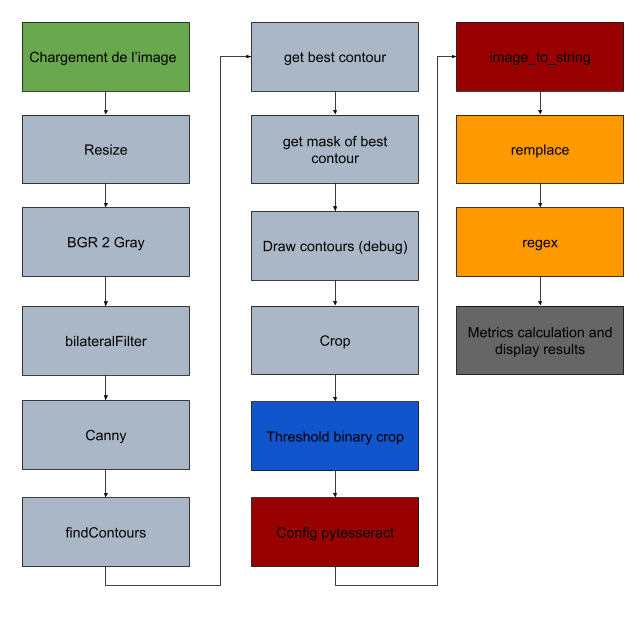

# omgOCR

## Stack


You can find a related post for this repository :

+ Project: "N:\01 Produits\JI3\JI3-700"
+ Git: "G:\omgOcr.git"


## Repos
This repo is used for integration of Optical Character Recognition (OCR) into trucs for plate license recognition.</ul>
***

## Install and run project
> + Download Pycharm in official website, community or premium version: [www.jetbrains.com](https://www.jetbrains.com/fr-fr/pycharm/download)
> + Go to working directory
> + Open git bash
> + Run -> "$ git clone G:\omgOcr.git"
> + Run -> "$ git checkout develop"
> + Open Pycharm and load project
> + Add configuration, set in arguments "-t -v"
> + Run it!

## Algorithm


## Documentation
+ [__init__](doc/opt/__init__.html)- the /__init__</li>
+ [core](doc/opt/core.html)- the core</li>
+ [displayplate](doc/opt/displayplate.html)- the displayplate</li>
+ [ocr](doc/opt/ocr.html) - the ocr
+ [ocrposttreatment](doc/opt/ocrposttreatment.html) - the ocrposttreatment
+ [ocrutils](doc/opt/ocrutils.html) - the ocrutils


## File structure
```
.
│   .gitignore
│   build.sh
│   linux-install.sh
│   README.md
│   requirements.txt
│   run-c.sh
│   run.sh
│   setup.py
│
├───data
│   ├───dataset_0
│   │       AA-434-AB.jpg
│   │       CK-043-WQ.jpg
│   │       FA-235-FB.jpg
│   │       FE-010-HL.jpg
│   │
│   ├───dataset_1
│   │       1-ABC-123.jpg
│   │       168 CD 66.jpg
│   │       AA-434-AB.jpg
│   │       AB-123-CD.jpg
│   │       CH-242-GP.jpg
│   │       CK-043-WQ.jpg
│   │       FA-235-FB.jpg
│   │       FE-010-HL.jpg
│   │       FG-063-FM.jpg
│   │
│   └───dataset_2
│           1.png
│           2.jpg
│           EE-010-HL.png
│           FE-000-HL.png
│           FE-010-HH.png
│
├───doc
│   │   generate-doc.sh
│   │
│   ├───opt
│   │       core.html
│   │       displayplate.html
│   │       ocr.html
│   │       ocrposttreatment.html
│   │       ocrutils.html
│   │       __init__.html
│   │
│   └───res
│           ocr_algo.png
│
├───log
├───res
│   └───tessdata
│           fra.traineddata
│
├───src
│   │   cameracsi.py
│   │   core.py
│   │   displayplate.py
│   │   mock.py
│   │   ocr.py
│   │   ocrposttreatment.py
│   │   ocrutils.py
│   │   plate.py
│   │   __init__.py
│   │
│   └───__pycache__
│           cameracsi.cpython-38.pyc
│           core.cpython-38.pyc
│           displayplate.cpython-38.pyc
│           mock.cpython-38.pyc
│           ocr.cpython-38.pyc
│           ocrposttreatment.cpython-38.pyc
│           ocrutils.cpython-38.pyc
│           plate.cpython-38.pyc
│           __init__.cpython-38.pyc
│
└───tests
    │   test_ocr.py
    │   test_ocrposttreatment.py
    │   test_ocrutils.py
    │   __init__.py
    │
    └───res
            AA-434-AB.jpg
            FE-010-HL.jpg
```
